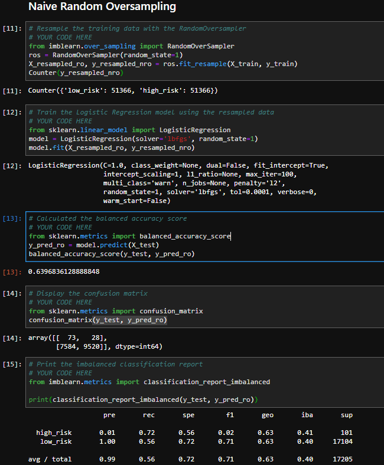
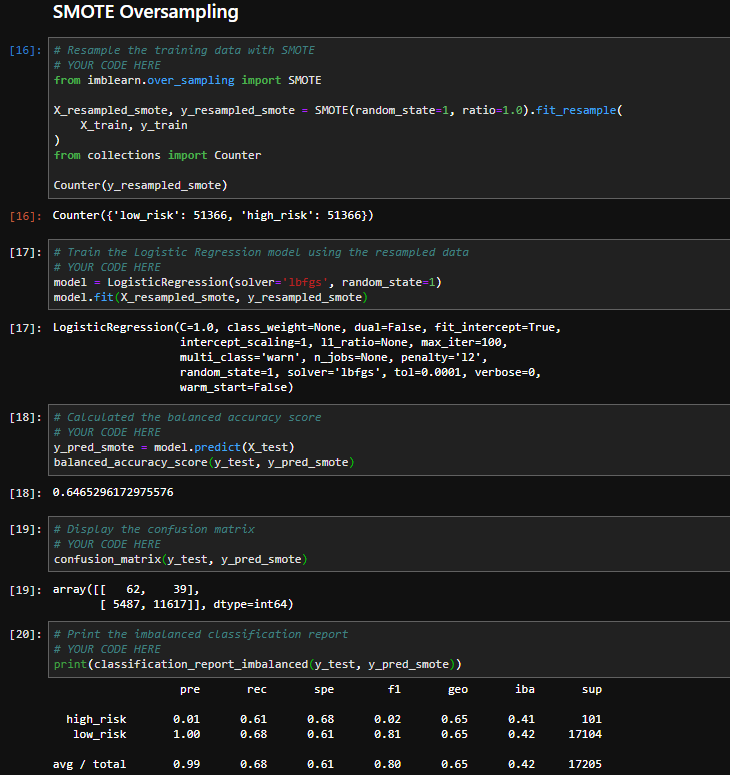
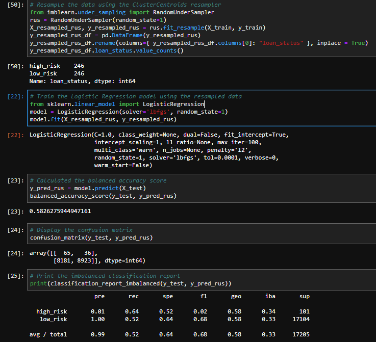
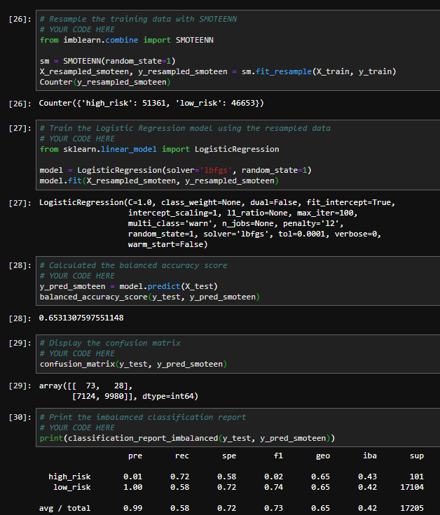
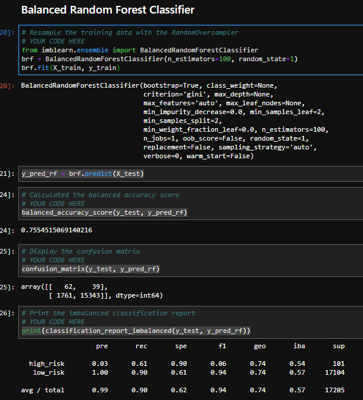
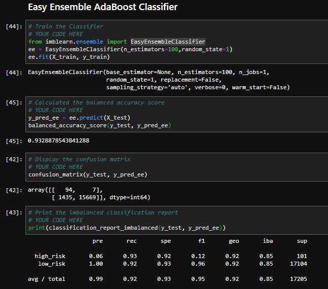

##  Credit Risk Resampling Techniques
#### Naive Random Oversampling

####  SMOTE Oversampling

#### Undersampling

#### Combination (Over and Under) Sampling

1. Which model had the best balanced accuracy score??
* SMOTE 0.6465296172975576

2. Which model had the best recall score?
* SMOTE 0.68

3. Which model had the best geometric mean score?
* SMOTE 0.65

## Ensemble Learning
#### Balanced Random Forest Classifier

#### Easy Ensemble Classifier

1. Which model had the best balanced accuracy score?
* Easy Ensemble Classifier 0.9328878543841288
2. Which model had the best recall score?
*  Easy Ensemble Classifier 0.92
3. Which model had the best geometric mean score?
* Easy Ensemble Classifier 0.92
4. What are the top three features?
* total_rec_prncp	0.074565
* last_pymnt_amnt	0.069408
* total_pymnt_inv	0.067116